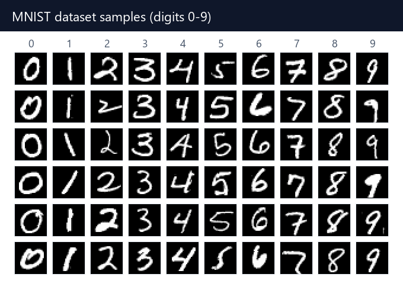
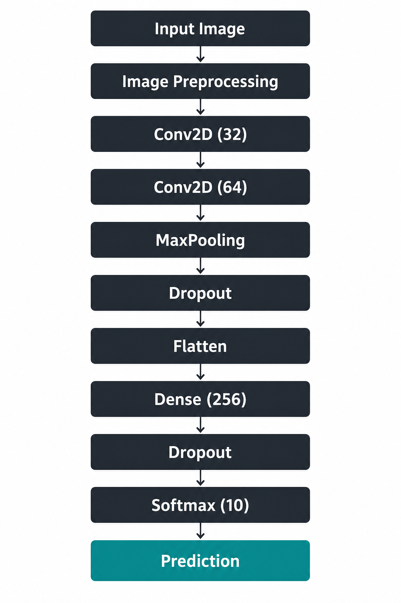
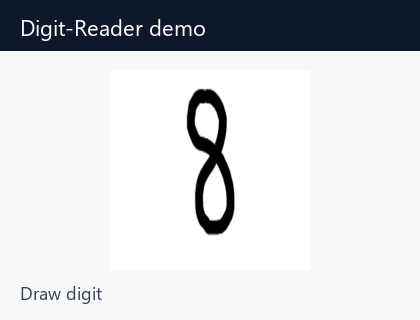
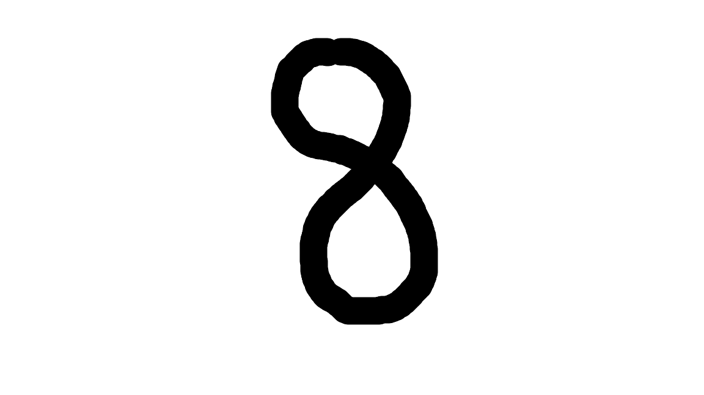
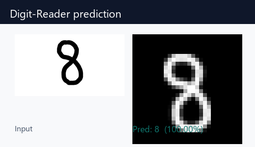
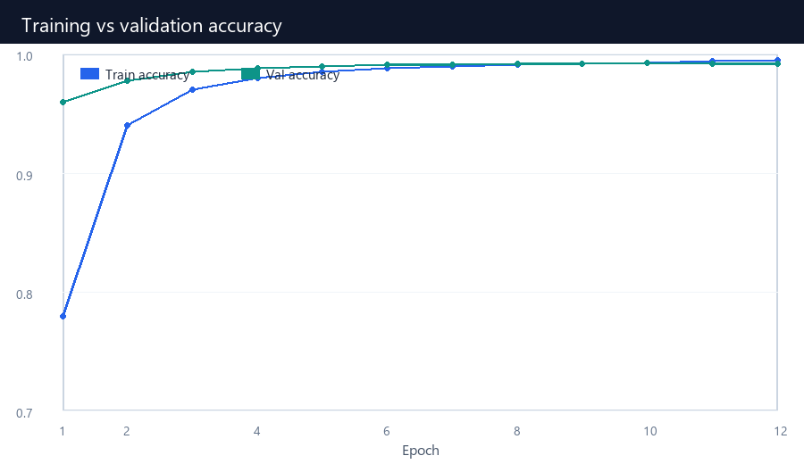
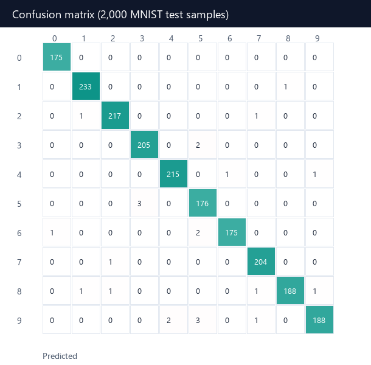

---

# 🧠 Digit Recognition using Computer Vision

This project is a **computer vision model** that recognizes handwritten digits from **0 to 9**. It demonstrates how machine learning and deep learning techniques can be applied to digit classification, making it useful for learning purposes and as a foundation for more advanced OCR (Optical Character Recognition) systems.

All runnable code lives in a **single Jupyter notebook** (`Digit_Reader.ipynb`).


---

## 🚀 Features

* Recognizes handwritten digits **0–9**.
* Built using **Python**, **TensorFlow**, and **Keras**.
* CNN with ~**99.1%** held-out MNIST test accuracy.
* Preprocessing pipeline for custom handwritten images.
* Automatic model save/load with early stopping.
* Easy-to-use single notebook for training and prediction.

---

## 📂 Project Structure

```
├── assets/                # README images (samples, demo, results)
├── Digit_Reader.ipynb     # Full train + predict pipeline
├── Untitled.png           # Sample handwritten digit
├── saved_models/          # Trained model (mnist.keras)
├── requirements.txt       # Dependencies
├── LICENSE
└── README.md              # Project documentation
```

---

## ⚙️ Installation

1. Clone this repository:

   ```bash
   git clone https://github.com/w0lf-s/Digit-Reader.git
   cd Digit-Reader
   ```

2. Create and activate a virtual environment (use **Python 3.13**):

   ```bash
   py -3.13 -m venv .venv
   source .venv/bin/activate   # For Linux/Mac
   .venv\Scripts\activate      # For Windows
   ```

3. Install the dependencies:

   ```bash
   pip install -r requirements.txt
   python -m ipykernel install --user --name digit-reader --display-name "Digit-Reader (3.13)"
   ```

---

## 📊 Dataset

* The model is trained on **[MNIST](https://keras.io/api/datasets/mnist/)**: 60,000 training and 10,000 test grayscale images of digits **0–9**.
* Each image is **28×28** pixels (white digit on black background).
* Custom inputs are preprocessed (invert, thicken thin strokes, crop, center, normalize) before prediction.

<p align="center">
  
</p>

---

## 🏗️ Model Architecture

* Input → **28×28×1** grayscale image
* Conv2D (32, 3×3, ReLU) → Conv2D (64, 3×3, ReLU)
* MaxPooling (2×2) → Dropout (0.25)
* Flatten → Dense (256, ReLU) → Dropout (0.5)
* Softmax output for **10 classes** (digits 0–9)

<p align="center">
  
</p>

```
Input (28×28×1)
   → Conv2D 32 → Conv2D 64 → MaxPool → Dropout
   → Flatten → Dense 256 → Dropout → Softmax 10
```

---

## 🏃 Usage

1. Open `Digit_Reader.ipynb`
2. Select kernel **Digit-Reader (3.13)** (`.venv`)
3. Run all cells top to bottom

* The notebook trains the CNN (or loads `saved_models/mnist.keras` if it already exists).
* The last cell predicts on `Untitled.png` (change `IMAGE_PATH` to try another image).

<p align="center">
  
</p>

---

## 📈 Results

* Held-out test accuracy: **99.1%**
* Example prediction:

| Input Image | Predicted Digit |
| --- | --- |
|  | **8** (100.00%) |

<p align="center">
  
</p>

### Training curves

<p align="center">
  
</p>

### Confusion matrix

<p align="center">
  
</p>

---

## 🔮 Future Work

* Extend recognition to multiple numbers in one image.
* Draw digits directly in a browser UI.
* Deploy as a **web app** using Flask/Streamlit.
* TensorFlow Lite / mobile support.

---

## 🤝 Contributing

Contributions are welcome! Feel free to fork this repo, open issues, or submit pull requests.

---

## 📜 License

This project is licensed under the **MIT License** – feel free to use and modify it.

---
